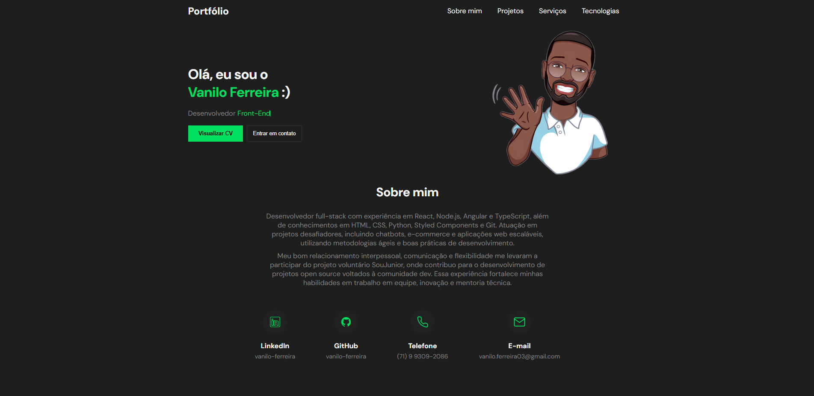
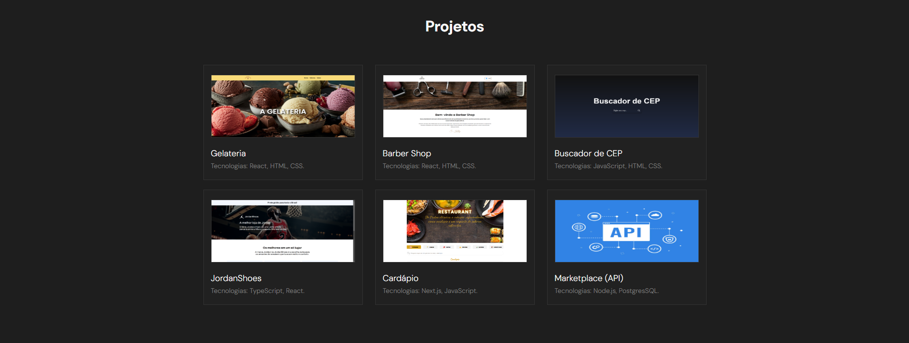
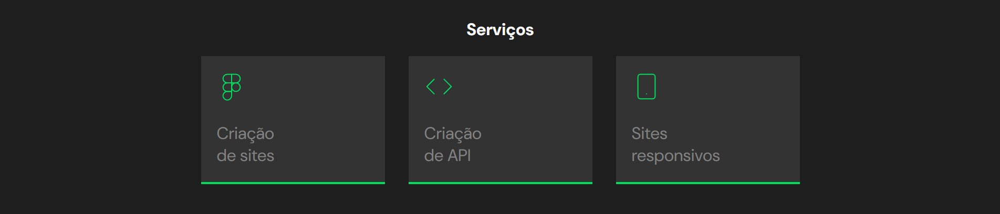
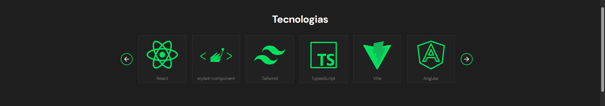
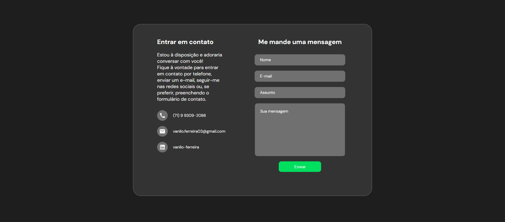

# Portfólio Pessoal 💼

Este repositório contém o código-fonte do meu portfólio pessoal, desenvolvido com o objetivo de apresentar e organizar os projetos que venho construindo ao longo dos anos. Embora já funcional, o portfólio ainda passará por atualizações constantes, com o intuito de incorporar melhorias como responsividade aprimorada, opção de alternância de tema (claro/escuro), uma página dedicada para listar todos os projetos desenvolvidos — além da seção atual com destaques — e outras funcionalidades que agreguem valor à experiência do usuário. O projeto também serve como uma vitrine das minhas habilidades técnicas, dos serviços que ofereço e como canal de contato direto com possíveis parceiros ou contratantes.

## 🎯 Objetivos

- Armazenar e apresentar projetos que desenvolvi ao longo da minha trajetória.
- Criar um canal centralizado para divulgar meus serviços e experiências.
- Facilitar a comunicação com interessados por meio de um formulário de contato funcional.
- Compartilhar informações sobre as tecnologias que domino e com as quais trabalho frequentemente.

## 🧭 Seções do Portfólio

### 1. Sobre Mim

Uma breve apresentação pessoal, incluindo um resumo da minha trajetória e motivações como desenvolvedor.

<figure>
  
  <figcaption align="center">
    Figura 1.
    
  Topo do Páginna e Seção Sobre Mim.</figcaption>
</figure>

### 2. Projetos

Apresentação de projetos em destaque que desenvolvi, com foco nas soluções e tecnologias utilizadas.

<figure>
  
  <figcaption align="center">
    Figura 2.
    
Seção Projetos.</figcaption>
</figure>

### 3. Serviços

Espaço dedicado para listar os principais serviços que ofereço, como desenvolvimento web, Criação de API, entre outros.

<figure>
  
  <figcaption align="center">
    Figura 3.
    
Seção Serviços.</figcaption>
</figure>

### 4. Tecnologias

Lista das tecnologias que possuo conhecimento.

<figure>
  
  <figcaption align="center">
    Figura 4.
    
Seção Tecnologias.</figcaption>
</figure>

### 5. Contato

Um formulário funcional onde visitantes podem enviar mensagens diretamente para mim. As mensagens são processadas pelo back-end Node.js, utilizando a biblioteca Nodemailer para envio por e-mail.

<figure>
  
  <figcaption align="center">
    Figura 5.
    
Formulário para Contato.</figcaption>
</figure>

## 🚀 Tecnologias Utilizadas

### 🖥️ Front-end

- **React** – Biblioteca JavaScript para construção de interfaces modernas e reativas.
- **TypeScript** – Superset do JavaScript que adiciona tipagem estática ao código.
- **Material-UI (MUI)** – Biblioteca de componentes React com design baseado no Material Design.
- **Vite** – Ferramenta de build extremamente rápida, utilizada para desenvolvimento e empacotamento do front-end.

### 🔧 Back-end

- **Node.js** – Plataforma de desenvolvimento back-end baseada em JavaScri;
- **Nodemailer** – Biblioteca utilizada para envio de e-mails através do formulário de contato.

## 📦 Deploy do Projeto

O deploy da aplicação foi realizado na plataforma [Vercel](https://vercel.com/).
E poderá ser acompanhado através do seguinte link: [Vanilo Ferreira - Portfólio](https://portfolio-one-flame-10.vercel.app/).
